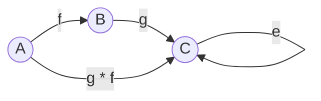

## Category Theory as a theory about Composition

Some time ago the principles of structured programming
revolutionized programming because they made blocks of code
composable. Then came object oriented programming, which is
all about composing objects. Functional programming is not
only about composing functions and algebraic data
structures; it makes concurrency composable, somethings
that's virtually impossible in other programming languages.

Functional programming is a subset of a more important
overaching programming paradigm: compositional programming.
Category Theory codifies this compositional style in a
design pattern: the category. Unlike other design patterns,
the _category laws_ provides rigorous criteria for what does
and does not qualify as compositional.

## Definitions

A Category is a two-sorted structure that encodes the
algebra of composition. It has:

- objects
- arrows
- each pair of composable arrows has a composite arrow.
- each object has an *identity arrow* for which the
    composition operation is *associative* and *unital*.



> Isomorphism invariance principle: If $A$ and $B$ are
> isomorphic then every category theoretic property of $A$
> is also true of $B$

### Examples of categories

- The category Set: objects are (finite) **sets** and arrows
    are **functions**.
- The syntactic category for some programming languages:
    objects are **types** and arrows are **programs**. The categorical
    imperative "programs should form a category" leads to the notion of
    **monad**.


## Category Laws

Category theory says that for any given category there must
be some sort of composition operator, say (·).

> Composition means we can omit arrows that can be deduced.

- First Law: This composition operator is associative
```haskell
f · (g · h) = (f · g) · h
```

- Second Law: This composition operator must have a left and
    right identity
```haskell
I · f = f
f · I = f
```

## The function category in Haskell

```haskell
id :: a -> a
id x = x

(.) :: (b -> c) -> (a -> b) -> (a -> c)
f . g = \x -> f (g x)

{-- Associativity
    (f . g) . h
    == \x -> (f . g) . (h x)
    == \x -> f (g (h x))
    == \x -> f ((g . h) x)
    == \x -> (f . (g . h)) x
    == f . (g . h)
-}
```


### The Kleisli category in Haskell

This is the category of monadic functions, which generalize
ordinary functions. Mathematicians call this the "Kleisli"
category, and `Control.Monad` provides this two functions.
Monadic functions just generalize ordinary functions and the
Kleisli category demonstrates that monadic functions are
composable, too.

```haskell
return  :: Monad m => a -> m a
(<=<)   :: Monad m => (b -> m c) -> (a -> m b) -> (a -> m c)

-- Compare both categories
id     ::              (a ->   a)
return :: (Monad m) => (a -> m a)

(.)    ::              (b ->   c) -> (a ->   b) -> (a ->   c)
(<=<)  :: (Monad m) => (b -> m c) -> (a -> m b) -> (a -> m c)

(f  .  g) x = f     (g x)
(f <=< g) x = f =<< (g x)
```

### From Kleisli to Monad Laws

```haskell
-- The Category Laws in Kelisli
return <=< f    == f                -- Left  identity
f <=< return    == f                -- Right identity
(f <=< g) <=< h == f <=< (g <=< h)  -- Associativity

-- Using (=<<) from the definition of (<=<)
return =<< (f x)            == (f x)
f =<< (return x)            == f x
(\y -> f =<< (g y)) =<< h x == f =<< (g =<< (h x))

-- Using (>>=) to flip the order of arguments
m >>= return            == m
return x >>= f          == f x
m >>= (\y -> g y >>= f) == (m >>= g) >>= f
```

## References

- [Peeling the banana: Recursion Schemes from first principles](https://www.youtube.com/watch?v=XZ9nPZbaYfE)
- [The Category design Pattern](https://www.haskellforall.com/2012/08/the-category-design-pattern.htm)
