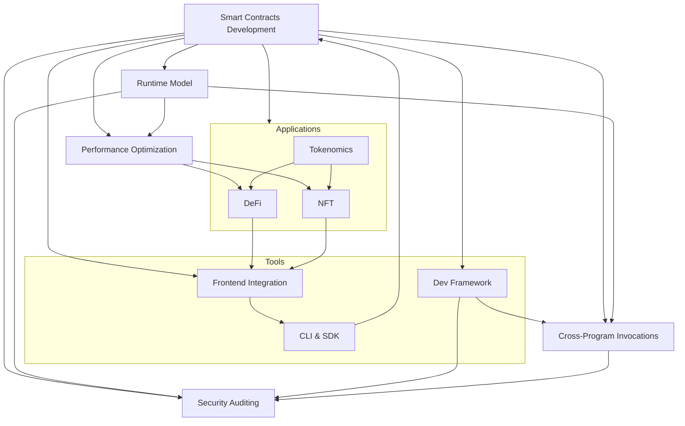

# Common terms

- **CAP theorem**: A principle stating that in distributed
systems, only two of the following three properties are
achievable at the same time:
    - _Consistency_: all nodes have the same data
    - _Availability_: system is responsive
    - _Partition Tolerance_: system continues operating despite network partitions

- **Consensus algorithm**: A protocol used by distributed systems
to achieve agreement among nodes on the state of the `ledger`,
even in the presence of faulty or malicious actors.

- **Fault tolerant replicated machine**: A system where multiple
nodes replicate the same state and continue functioning correctly
even if some nodes fail or act maliciously.

- **Finality**: The assurance that once a transaction is added to
the blockchain, it cannot be altered or reversed (transaction
permanence).

- **Fork**: A divergence in the blockchain's protocol or ledger. It
can be soft (backward-compatible) or hard (creating two separate
chains).

- **Horizontal scaling**: The process of adding more nodes to a
distributed system to increase its capacity and performance,
rather than upgrading the hardware of existing nodes.

- **Ledger**: A distributed and immutable record of transactions
shared across a network of nodes in a blockchain. It ensures
transparency, traceability and trust.

- **Sharding**: A method for improving scalability in blockchains
by partitioning the network's `state` and transactions into
smaller, manageables pieces (shards). This allows the system to
process many transactions in parallel.

| Abstract Term          | In Cloud Computing          | In Blockchain                          |
| ---------------------- | --------------------------- | -------------------------------------- |
| **Stateless Function** | Lambda Functions            | Smart contracts                        |
| **Horizontal Scaling** | Adding more servers/nodes   | Adding more nodes (validators/miners)  |
| **Consensus**          | Leader election, Paxos/Raft | PoW, PoS, BFT, PoA                     |
| **NoSQL Databases**    | DynamoDB, MongoDB           | Distributed ledgers (e.g., Ethereum)   |
| **Virtual Machines**   | EC2, Kubernetes pods        | EVM (Ethereum), WASM (Polkadot)        |
| **Transaction Logs**   | Database write-ahead logs   | Blockchain ledger                      |
| **Load Balancing**     | Traffic distribution (ELB)  | Transaction propagation across nodes   |
| **Data Sharding**      | Database partitioning       | Blockchain state sharding              |
| **Fault Tolerance**    | Redundant infrastructure    | Byzantine Fault Tolerance (BFT)        |
| **Authentication**     | IAM, OAuth                  | Public/private keys, cryptography      |
| **State Management**   | Session/Cache databases     | Account balances, Contract state)      |
| **Immutable Data**     | Write-once storage (S3)     | Immutable transaction history          |
| **Snapshot**           | Database snapshots          | Blockchain checkpoints                 |

## Smart Contracts Development

